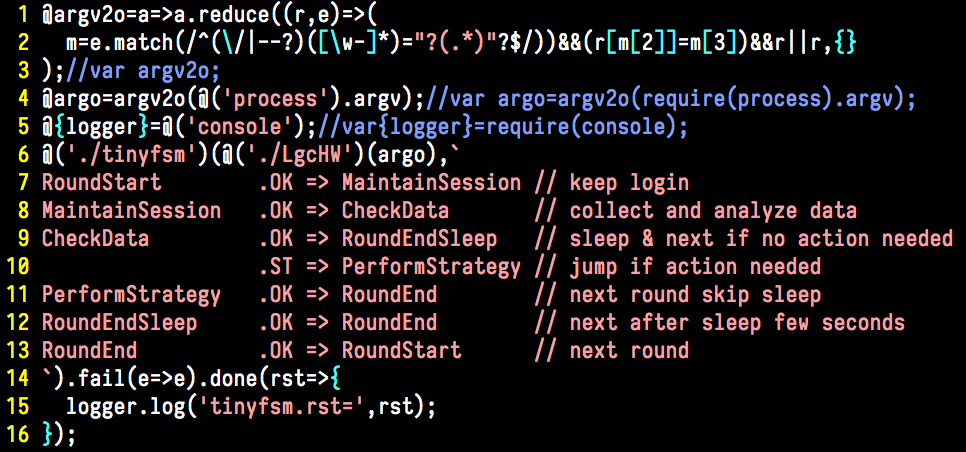

# SAO

A Very "Sao" Computer Language

```
                         :yyydmmmMMMh`                  
       yMh+smNMMd-      -NMMMMMMMMMMM:                  
       mMMMMMMMMN/       +mMNhoodMMMN`                  
      `NMMyMMMh-`        .:+-   hMMMh                   
      `NMN.MMMh          dMMMo .NMMM/                   
      -NMy`MMMy`      -` `yMMM-sMMMy                    
      /MM+/MMMMN+   `dMNy- +Nd-NMMM-                    
      oMMMMMMMMd+    `+mMMy. `hMMMy                     
      oMNsmMMMs        `yMMMdmMMMN.                     
      oMN`/MMM:          /NMMMMMMs                      
      oMm oMMMNm+         +MMMMMM+                      
      sMMmMMMMMNo         -NMMMMMMNo`                   
      hMNNMMMMo          /NMMMMMMMMMNd/-                
      dMo`hMMN`        `sMMMMNooNMMMMMMMms/`            
     `mMy sMMh`/:     .dMMMMMMMh`oNMMMMMMMMNy+.         
     .NMdodMMNNMMs   -mMMMd/dMMM: :NMMMMMMMMMMMNmh+.    
     :MMMMMMmdmMMM/ /NMMN/ `mMMMmhNMMMNmMMMMMMMNNNNm`   
     .NMNy+.  :MMMmoho/NMymMMMMMyodMMMm`:ohmy/.         
      sM+ .::-/MMMh    yMmdNMMMM. dMMMs                 
       /- `dMMNMMMo    +Mh `mMMm oMMMm`                 
    /` oMN:`oNMMMN:    :Mm -MMMMNMMMs`                  
os- dNo`yN+  `hMMM-    -NMmNMMMMMMmo                    
dMd /Nm` ~`   sMMN.    .NMMMMMMh.``Md:                  
/MN- `        hMMm`    `dM//MMM:   dMM+                 
 oN`         `NMMh      `h.oMMM-   yMMN:                
             :MMMo         yMMN+shddMMMh                
        `hms+hMMN.        :NMMMMN/ `mMMN.               
          oNMMMMs      `/hMMMMdo.   yMMM/               
           oMMMd` `+oodMMMMho.      oMMM+               
           -NNo`  +MMMMMNs.         -NMM+               
            +-    .dMMMd-            /Ny`               
                   `ohs               -                 
```



# Feature

Phrase Zero

* core syntax sugar [proven]
* keyword-less - removed all english keywording

Phrase I

* FFI/DL            - dynamically load libraries
* ext syntax sugar

Phrase II

* bootstrap         - self-hosting
* more syntax sugar
* BSON built-in support

Phrase III

* OS mode
* multi-processing/multi-threading/coroutines
* hardware abstracted binary codes + vm interpretor
* sao-vm with qemu
* promise/q     - built-in promise support
* await/async

# Syntactic-Sugar

## Core 

| sao | c/js/php | brain-helper |
|---|---|---|
| ()?():() | ()?():() | classic ternary operator |
| @? | if | ask => if |
| @: | else |  |
| @:@? | else if |  |
| @?(){} | if(){} |
| @?(){}@:{} | if(){}else{} |
| @?(){}@:@?(){}@:{} | if(){}else if(){}else{} |
| @# | switch | #=>hash=>hasing=>switch |
| @! | break | ! => astonished => break |
| @% | continue | % => percent => continue |
| @\_ | do| bottom line => just do it |
| @= | case | case => equals |
| @\*(;;){} | for(;;){} | \* => all => for loop |
| @$(){} | while(){} | money => loop |
| @\_{}@$() | do{}while() | 
| @~ | return | |
| @^ | function | |
| @^XXX(){} | function XXX(){} |

designing...

| sao | c/js/php | remember-helper |
|---|---|---|
| stdin/stdout/stderr | | |
| json | | core structure like lua-table ? |
| lbl: |  | label for jumping |
| @1 | true | |
| @0 | false | |
| @& | null | |
| @ | var | |

* use the Core level to build the vm runner
* delimiter(;) is strongly recommented, but somehow/sometime it works when omited
* parentheses {} is very important for matching

e.g.

```
@#(x){@=1:@!;@=2:x+2;@!;@=:x-1;}
	switch(x){case 1:break;case 2:x+2;break;default:x-1;}

@*(i=1;i<x;i++){@?(i%3==0)@%}
	for(i=1;i<x;i++){if(i%3==0)continue;}
```

## Not support syntax sugar...

Abandom feature from ES (which should be using sao runtime)
```
@sao=@('sao')
```
|    | this | |
|    | new | |
|    | typeof | |
|    | instanceof | |

## Ext Syntactic Sugar (W.I.P.)

* make parse into two levels ( default buildin .core and then .ext )

| sao | pseudo | remember-helper |
|---|---|---|
| @<?()@?!(ex){}@?!>{}@\>!{} | try/catch/finally | |
| @() | require() | module import |
| x\|\|z | (tmp=x)?tmp:z | binary operator |
| @[] | var[] | destructuring |
| @{} | var{} | destructuring |
| ()=>{} | function(){} | closure |
| XXX = x => (x^2) | function XXX(x){ return x^2} | assign closure func to var |
| (...aaa)=>aaa | get the args |
| @:? | elseif | elif/elseif |
| @\_{}; | do{}while(0) | doonce{} |
| @\<\> | require() | buildin module import, @<c>,@<math>,@<console> |
| @\<c\>; | N/A | import c; |
| @\<cmath\>; | N/A | import cmath; |
|  | may give up typeing |
| XXX()\<type\>{} | type XXX(){} |
| ()type=>{} | function()type{} | declare return type |
| XXX(x)returnType{@~(x^2)} | function XXX()returnType{return (returnType)x^2;} |  |
| XXX = (x)\<SaoType*\> => (x^2) | function XXX()\<SaoType*\>{return \<SaoType\>x^2;} |  |
| XXX(x)\<c.byte8\>{@~(x^2)} | function XXX()\<c.byte8\>{return (\<c.byte8\>) x^2;} | ... |
|  | lang handler |
| @\*\<language-handler\>{..} | | eating .. with prefer language handler, * =\> mouth =\> eat |
| @\*\<SAO\>{..} | using SAO handler (default) to process .. |
| @\*\<SLJIT\>{..} | using SLJIT (StackLessJIT) handler to process .. |
| {..} @\|\<handler\> | | piping .. to handler |

# More TODO

* stdin/stdout/stderr is controlled/assigned by caller(the OS or intepreter)
* StackLess JIT
* stdin/stdout/stderr => std stream/pipe in/out
* piping
* dlfcn/ffi
* windows
* SaoOS

# FAQ

## What mean Sao?

https://en.wiktionary.org/wiki/%E9%A8%B7


